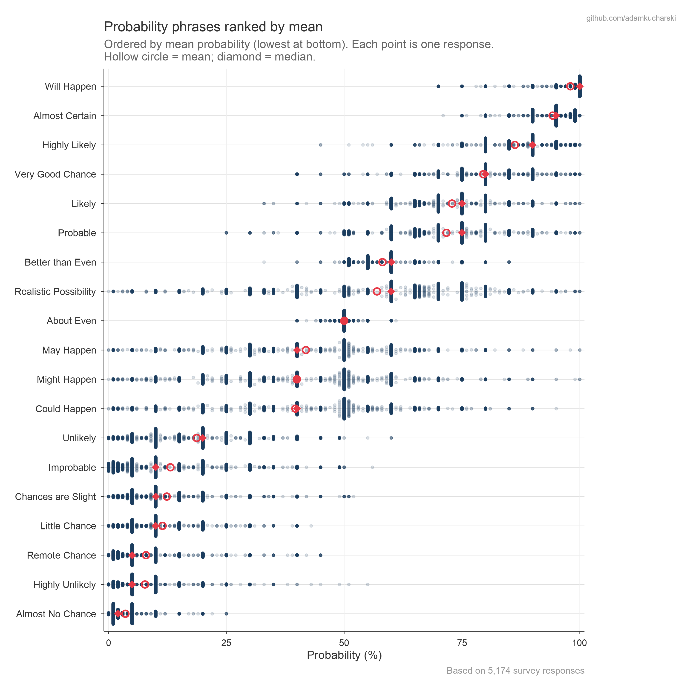
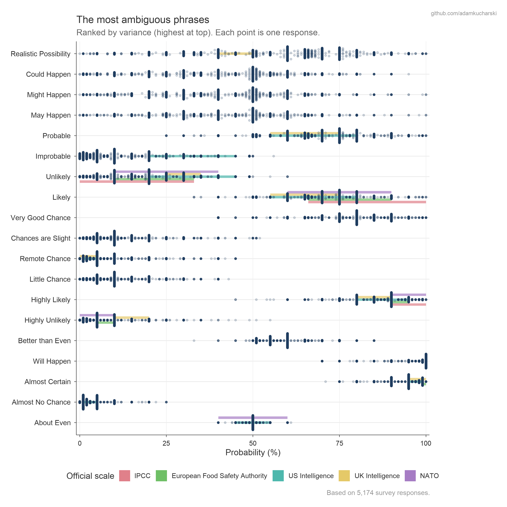
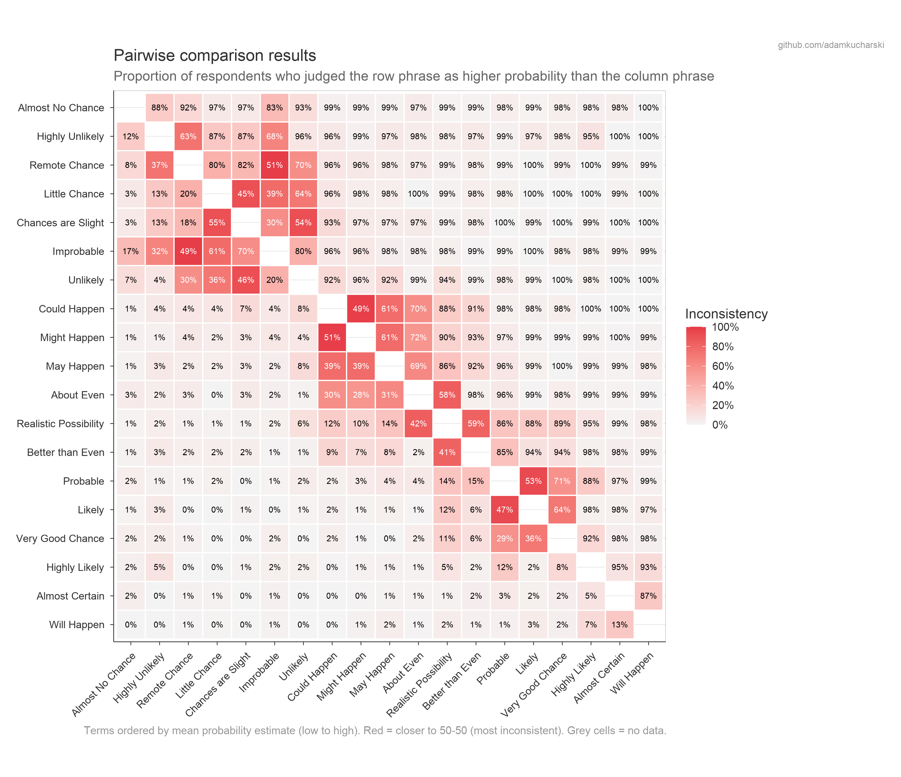
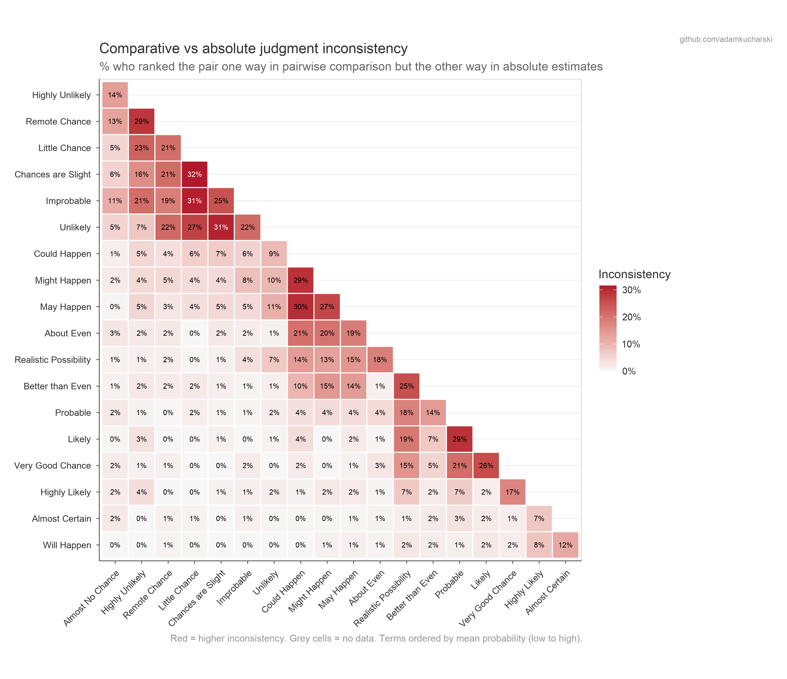
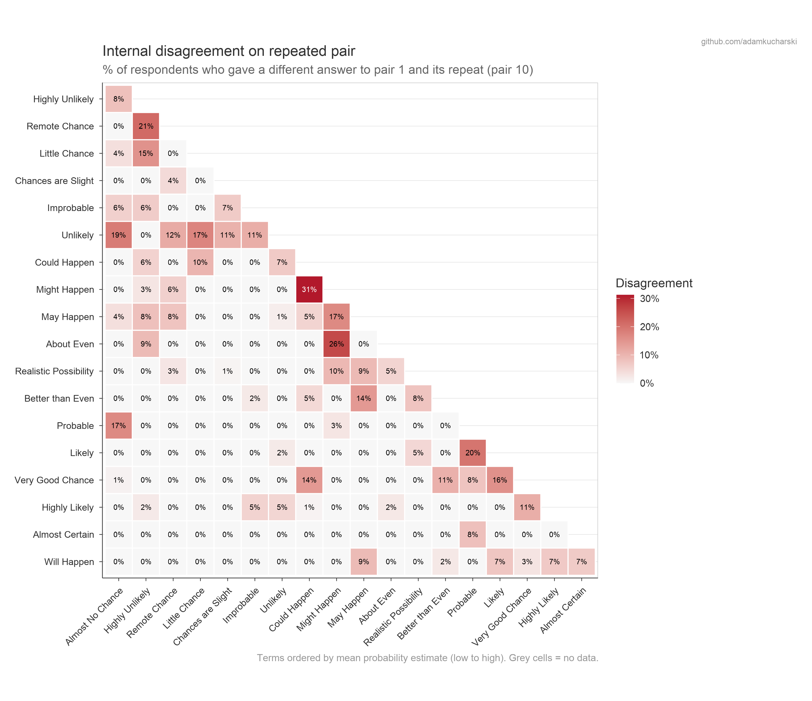
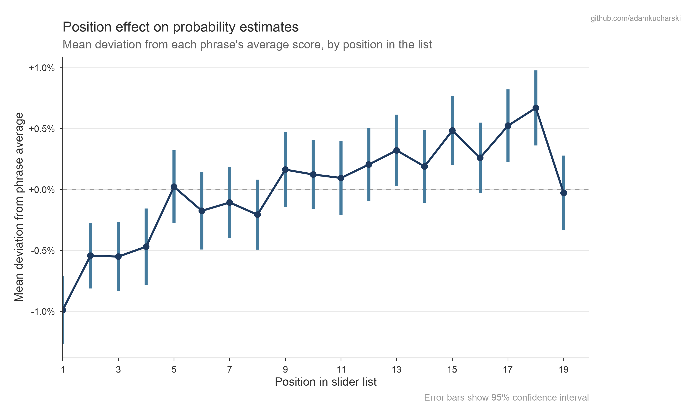
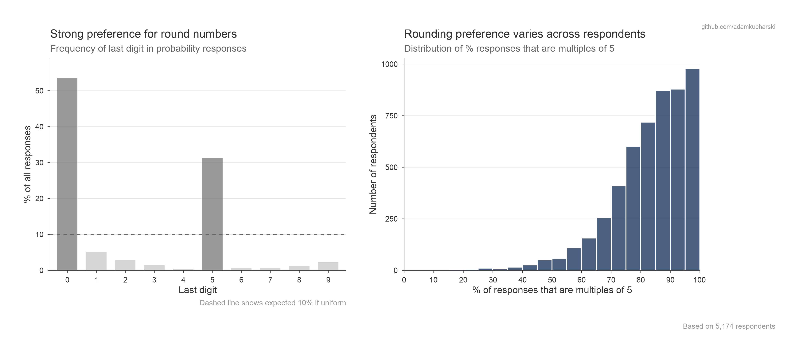
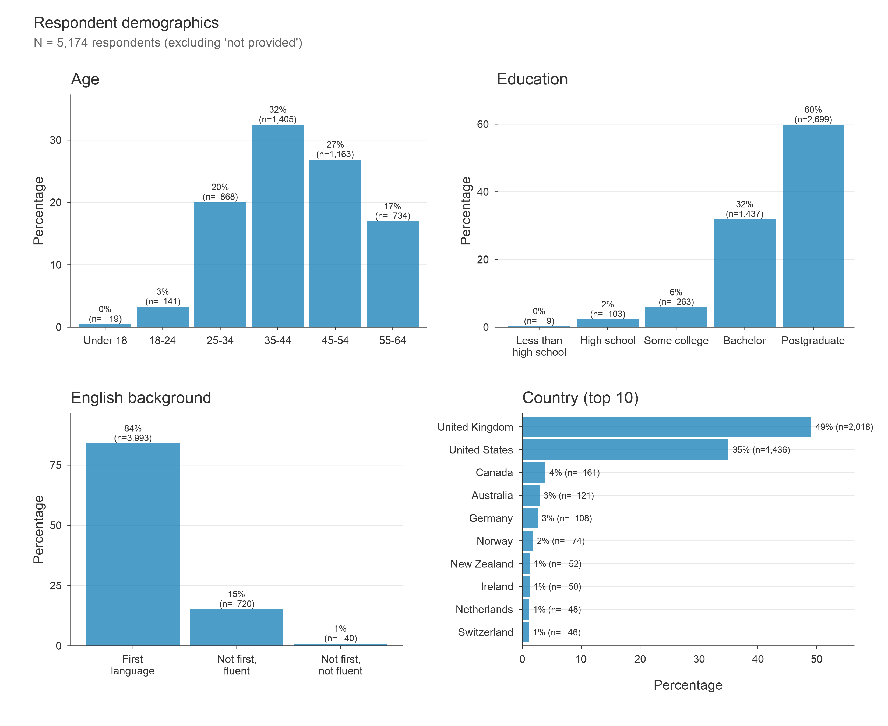
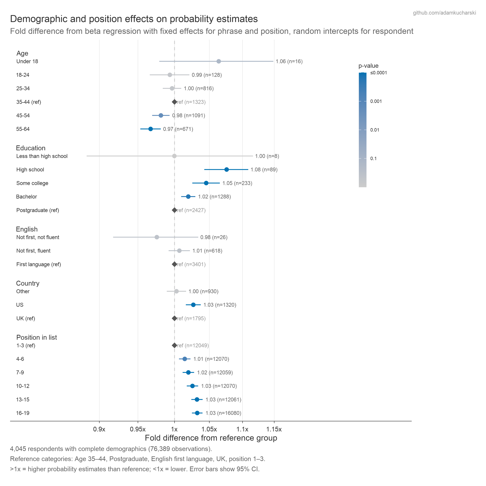

# CAPphrase: Comparative and Absolute Probability phrase dataset

This page presentes an analysis of how people interpret common probability phrases, based on data from over 5000 participants in an [online quiz](https://probability.kucharski.io/) created by Adam Kucharski.

The quiz had two parts: 1) respondents compared pairs of probability phrases (e.g. "Which conveys a higher probability: *Likely* or *Probable*?") and 2) they assigned numerical values (0--100%) to each of 19 phrases. Optional demographic questions were also collected.

---

## Probability estimates by phrase

The below shows the distribution of absolute numerical probability estimates for each phrase (i.e. from Part 2), ordered by mean value. The spread shows how differently people interpret the same words.

Here is the same plot ranked by variance, alongside a comparison with yardstick probability scales (e.g. intelligence community, IPCC).

---

## Pairwise comparisons

### Consistency heatmap

When shown two phrases and asked which conveys a higher probability, how often do respondents agree? The heatmap below shows the proportion choosing the row term over the column term.

### Part 1 vs Part 2 inconsistency

How often do respondents' pairwise choices (Part 1) conflict with their own numerical estimates (Part 2)? The below shows consistency in comparative vs absolute judgements.

### Self-disagreement in comparisons

All respondents were shown one pair twice, at the start and end of the Part 1 comparisons. The below shows the percentage of times than participants disagreed with themselves on the pair ordering for different phrases.

---

## Position effects

Does the order in which phrases are presented affect the numerical estimates people give? The below shows how much estimates deviated from the mean value depending on position in the list in Part 2.

---

## Individual response patterns

Participants were free to choose any number between 0-100% in the absolute judgements. The below shows how they used this scale, with digit-rounding tendencies particularly prominent.

---

## Demographics

Participants were invited to share some broad demographic data. The below distribution of respondents across age bands, education levels, English language backgrounds, and countries of residence.

---

## Demographic effects on estimates

Beta regression models were used to examine how demographic factors related to probability estimates, expressed in terms of fold differences from a reference group. Fixed effects were used for phrase and presentation position, with random effects for respondent.

---

## Methods

### Data collection

The quiz had three parts, administered in a single session:

1. **Part 1 -- Pairwise comparisons.** Respondents were shown pairs of probability phrases and asked which phrase conveys a higher probability. Each respondent sees 10 pairs (9 unique + 1 repeated pair for internal consistency checking).

2. **Part 2 -- Absolute probability estimates.** Respondents entered a numerical value (0--100%) for each of 19 probability phrases. The presentation order was randomised per respondent.

3. **Demographics.** Optional questions on age band, English language background, education level, and country of residence.

All data was collected anonymously; the quiz website did not collect any personal data (e.g. IP addresses, device identifiers, browser fingerprints, or location data). Participants were informed that the full dataset would be made publicly available in Feb 2026.

### Randomisation

- From the 19 terms, 18 were randomly sampled (i.e. the largest even number <= 19).
- The 18 terms were shuffled and paired sequentially to produce 9 unique pairs.
- Within each pair the left/right order was randomised.
- A 10th pair repeated the first pair with phrases swapped, providing an internal consistency check.
- Phrase presentation order for Part 2 was independently randomised per respondent.

### Outlier removal

Before analysis, absolute responses that fall more than 4 standard deviations from their term's mean were removed. This reduces the impact of potential misreadings for otherwise narrowly interpreted phrases (e.g. "Highly Unlikely" interpreted as "Highly Likely"), without affecting phrases that have a lot of variability in interpretation (e.g. "Might happen").

---

## Citation and licence

**Citation:** Kucharski A (2026) CAPphrase: Comparative and Absolute Probability phrase dataset.

**Licence:** CC-BY
